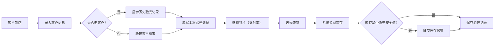

## 1. 产品概述

眼镜店验光与库存管理工具，面向小型眼镜店店主，用于管理客户验光记录、镜片/镜架库存及销售统计。解决手工记录混乱、库存管理不清晰、无法追溯客户历史验光数据的问题，提升门店运营效率。

## 2. 核心功能

### 2.1 用户角色
| 角色 | 注册方式 | 核心权限 |
|------|----------|----------|
| 店主/员工 | 直接使用（单用户系统） | 所有功能：验光记录、库存管理、客户查询、销售统计 |

### 2.2 功能模块
1. **首页仪表盘**：库存预警提醒、今日销售概览、快捷操作入口
2. **验光记录**：新建验光单、选择镜片/镜架、扣减库存
3. **库存管理**：镜片库存、镜架库存、入库/出库、安全库存设置
4. **客户管理**：客户列表、客户详情、历史验光记录对比
5. **销售统计**：月度销售统计、各折射率镜片销量排行

### 2.3 页面详情
| 页面名称 | 模块名称 | 功能描述 |
|----------|----------|----------|
| 首页仪表盘 | 库存预警卡片 | 显示低于安全库存的镜片和镜架，红色高亮提醒 |
| 首页仪表盘 | 今日概览 | 今日验光单数、销售额、待处理提醒 |
| 首页仪表盘 | 快捷操作 | 新建验光单、入库操作、客户查询入口 |
| 验光记录页 | 客户信息表单 | 输入姓名、电话，支持自动匹配老客户 |
| 验光记录页 | 验光数据表单 | 左右眼球镜度数、散光度数、轴位、瞳距 |
| 验光记录页 | 镜片选择 | 从库存选择折射率（1.56/1.60/1.67），显示剩余库存 |
| 验光记录页 | 镜架选择 | 从库存选择镜架型号，显示剩余库存 |
| 库存管理页 | 镜片库存列表 | 按折射率分类显示，支持入库、修改安全库存 |
| 库存管理页 | 镜架库存列表 | 按品牌/型号显示，支持入库、修改安全库存 |
| 客户管理页 | 客户列表 | 搜索、筛选客户，显示最近验光时间 |
| 客户管理页 | 客户详情 | 基本信息、所有历史验光记录对比表格 |
| 销售统计页 | 月度概览 | 本月销售副数、销售额、同比数据 |
| 销售统计页 | 折射率销量排行 | 柱状图展示各折射率镜片销量 |
| 销售统计页 | 销售明细列表 | 可查看指定月份的所有销售记录 |

## 3. 核心流程

客户到店配镜流程：
1. 录入客户姓名和电话（自动识别新/老客户）
2. 填写验光数据（左右眼度数、散光、轴位、瞳距）
3. 从库存选择镜片（需指定折射率）和镜架
4. 系统自动扣减镜片和镜架库存
5. 保存验光记录和销售订单
6. 库存低于安全库存时在首页提醒

## 4. 用户界面设计

### 4.1 设计风格
- **主色调**：深蓝 #1e40af（专业、稳重），搭配金色 #d97706（强调、高品质感）
- **辅助色**：暖灰背景 #f8fafc，红色 #dc2626 用于库存预警
- **按钮风格**：圆角中等（rounded-lg），悬停有深色渐变和轻微上浮效果
- **字体**：标题使用 Noto Serif SC（衬线体，专业感），正文使用 Noto Sans SC
- **布局风格**：顶部导航 + 左侧侧边栏 + 主内容区卡片式布局
- **图标风格**：使用 lucide-react 线性图标，统一 20px 尺寸

### 4.2 页面设计概览
| 页面名称 | 模块名称 | UI 元素 |
|----------|----------|---------|
| 首页仪表盘 | 库存预警卡片 | 红色渐变背景、预警图标、闪烁动画、列表展示 |
| 首页仪表盘 | 数据概览卡片 | 深蓝色卡片、大号数字、渐变边框、hover 上浮 |
| 验光记录页 | 验光数据区 | 左右眼分栏对称布局，表单输入框带单位后缀（D、°、mm） |
| 库存管理页 | 库存卡片网格 | 每个 SKU 一张卡片，库存条进度条、安全库存线标记 |
| 客户管理页 | 验光记录对比 | 时间轴布局，每条记录可展开对比度数变化 |
| 销售统计页 | 图表区 | 自定义柱状图，渐变色柱体，hover 显示详情 |

### 4.3 响应式
- 桌面端优先设计（最小 1280px 宽度）
- 平板端（768px-1280px）：侧边栏收起为图标模式
- 移动端（<768px）：顶部导航折叠为汉堡菜单，卡片单列排布
