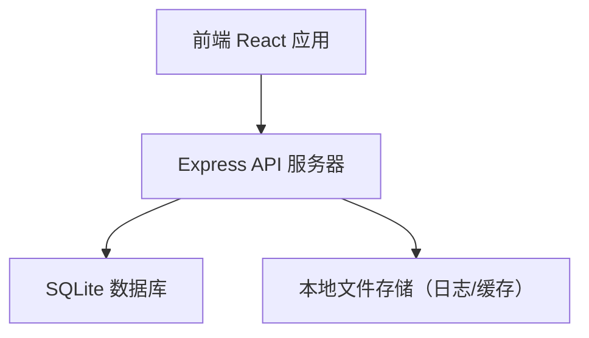
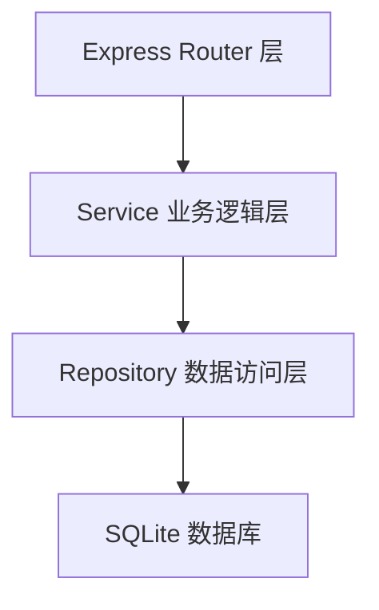
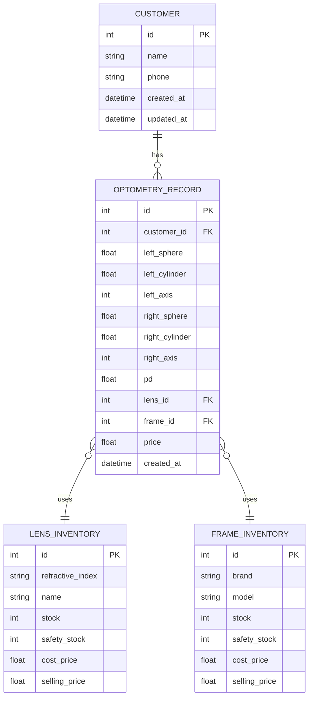

## 1. 架构设计



## 2. 技术说明

- **前端**：React@18 + TypeScript + TailwindCSS@3 + Vite
- **状态管理**：Zustand（前端状态）
- **路由**：React Router DOM
- **图表**：Recharts
- **图标**：Lucide React
- **后端**：Express@4 + TypeScript + ESM
- **数据库**：SQLite（better-sqlite3），单文件数据库，无需额外部署
- **初始化工具**：vite-init，使用 react-express-ts 模板

## 3. 路由定义

| 路由路径 | 用途 |
|----------|------|
| / | 首页仪表盘 |
| /optometry | 验光记录列表 |
| /optometry/new | 新建验光单 |
| /optometry/:id | 验光单详情 |
| /inventory | 库存管理（镜片+镜架） |
| /customers | 客户列表 |
| /customers/:id | 客户详情（含历史验光记录） |
| /statistics | 销售统计 |

## 4. API 定义

### 4.1 类型定义

```typescript
// 客户
interface Customer {
  id: number;
  name: string;
  phone: string;
  createdAt: string;
  updatedAt: string;
}

// 验光记录
interface OptometryRecord {
  id: number;
  customerId: number;
  // 左眼
  leftSphere: number;      // 球镜度数
  leftCylinder: number;    // 散光度数
  leftAxis: number;        // 轴位
  // 右眼
  rightSphere: number;
  rightCylinder: number;
  rightAxis: number;
  pd: number;              // 瞳距
  lensId: number;          // 镜片库存ID
  frameId: number;         // 镜架库存ID
  price: number;           // 成交价格
  createdAt: string;
}

// 镜片库存
interface LensInventory {
  id: number;
  refractiveIndex: '1.56' | '1.60' | '1.67';
  name: string;            // 商品名称
  stock: number;           // 当前库存
  safetyStock: number;     // 安全库存
  costPrice: number;       // 成本价
  sellingPrice: number;    // 售价
}

// 镜架库存
interface FrameInventory {
  id: number;
  brand: string;           // 品牌
  model: string;           // 型号
  stock: number;
  safetyStock: number;
  costPrice: number;
  sellingPrice: number;
}
```

### 4.2 接口列表

| 方法 | 路径 | 说明 |
|------|------|------|
| GET | /api/customers | 获取客户列表（支持按姓名/电话搜索） |
| GET | /api/customers/:id | 获取客户详情（含所有验光记录） |
| POST | /api/customers | 新建客户 |
| GET | /api/optometry | 获取验光记录列表（支持按月份筛选） |
| GET | /api/optometry/:id | 获取验光单详情 |
| POST | /api/optometry | 新建验光单（自动扣减库存） |
| GET | /api/inventory/lenses | 获取镜片库存列表 |
| POST | /api/inventory/lenses/:id/restock | 镜片入库 |
| PUT | /api/inventory/lenses/:id | 更新镜片信息（安全库存等） |
| GET | /api/inventory/frames | 获取镜架库存列表 |
| POST | /api/inventory/frames/:id/restock | 镜架入库 |
| PUT | /api/inventory/frames/:id | 更新镜架信息 |
| GET | /api/inventory/alerts | 获取库存预警列表（低于安全库存） |
| GET | /api/statistics/monthly?year=&month= | 月度销售统计 |
| GET | /api/statistics/lenses?year=&month= | 各折射率镜片销量统计 |

## 5. 服务端架构



## 6. 数据模型

### 6.1 ER 图



### 6.2 初始化数据

系统启动时自动初始化以下示例数据：
- 镜片库存：1.56（50片）、1.60（30片）、1.67（20片），安全库存各 10
- 镜架库存：3-5 个品牌型号，各 15-30 副，安全库存 5
- 5-10 个示例客户及验光记录
